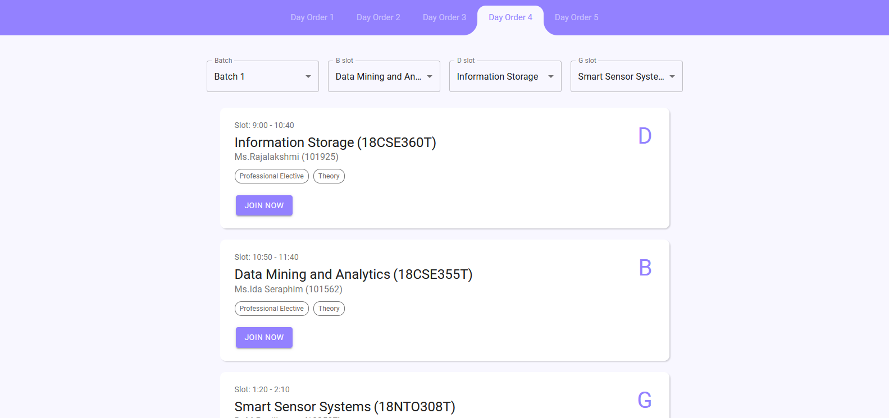
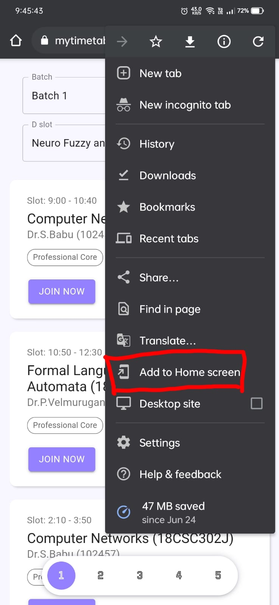
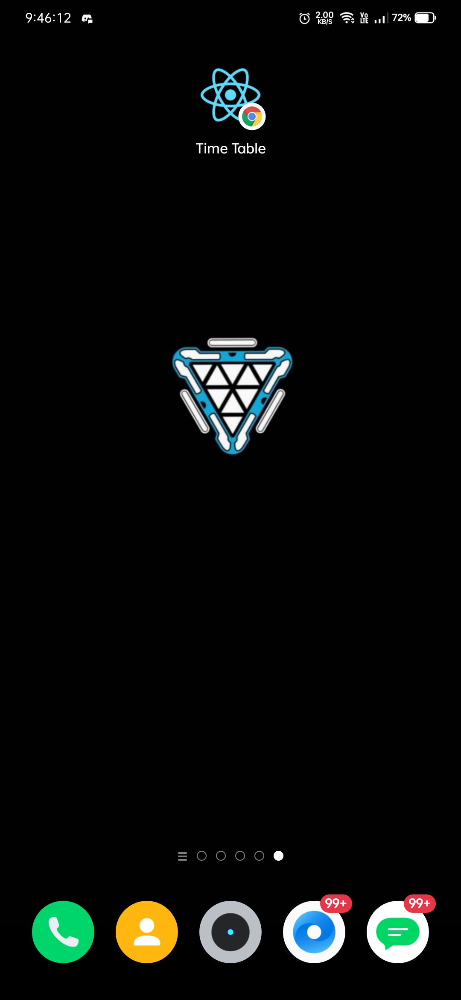
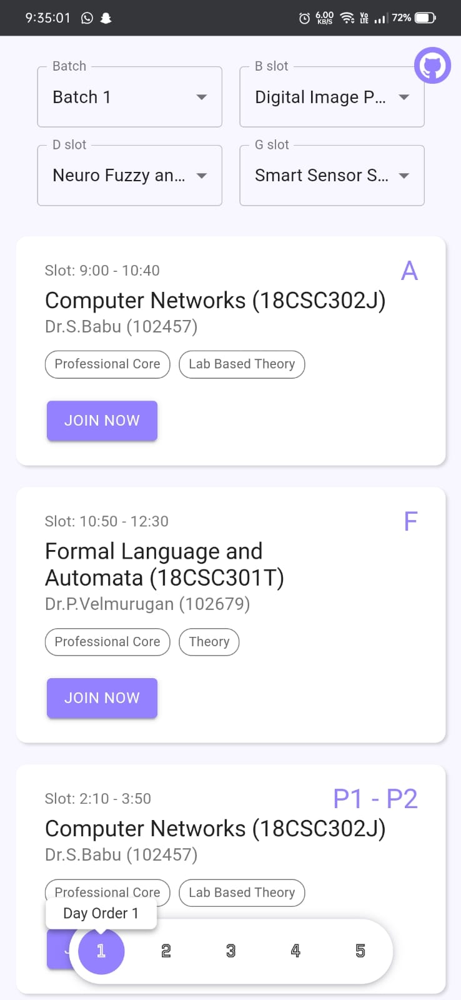

# Timetable for B1 CSE (5th Sem)

Tired of opening the Excel sheet and going to GCR for the link again and again? Here's a solution that might help in making things easier for you. Just open it and choose your batch and electives and you're all set for this semester.

<h3>Website: <a href="https://bit.ly/cseb1">bit.ly/cseb1</a></h3> 

Tech Stack used: 

 
    

# Professional Electives (B Slot)

- `Data Mining and Analytics`
- `Digital Image Processing`

# Professional Electives (D Slot)

- `Neuro Fuzzy and Genetic Programming`
- `Information Storage and Management`

# Open Electives (G Slot)

- `Smart Sensor Systems`
- `Total Engineering Quality Management`
- `B2B Marketing`
- `Fundamentals of Biomedical Engineering`
- `Financial Services`

# Laptop/PC

# Mobile

- Open the website in Google Chrome and choose this option.   
  
- On your homescreen you will be able to see this PWA, now you don't have to open the link in your browser again and again, you just have to click on this icon and you'll be redirected to the web application.   
  
- Cool, you're done. Now your timetable is just one click away.  
     

# Can't find your electives?

- Get in touch. <a href="mailto:m.muazam.99@gmail.com">`Click here`</a> 
- Contribute now by adding your electives <a href="https://github.com/mmuazam98/mytimetable/tree/main/src/timetable">`here`</a>

##

Leave a ⭐ if you like it.

